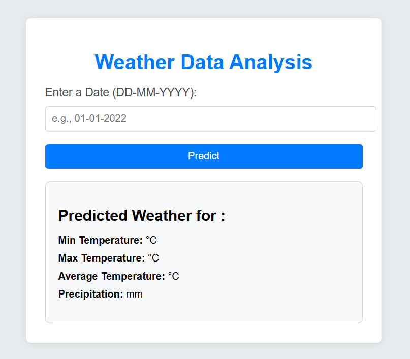
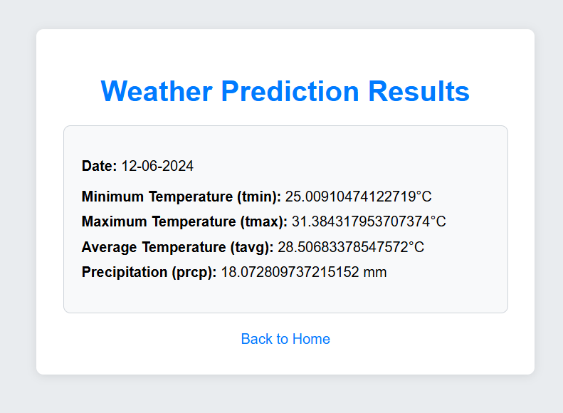
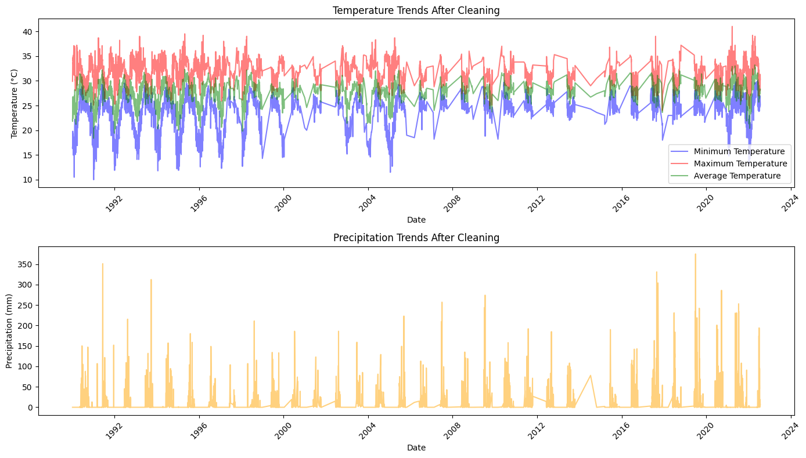

# 🌦️ Weather Prediction System

A Machine Learning based Weather Prediction System built using Flask, Python, and Scikit-Learn.  
This application predicts weather conditions such as minimum temperature, maximum temperature, average temperature, and precipitation based on a user-provided date.

---

## 🚀 Features

- 📅 Date-based weather prediction
- 🌡️ Predicts:
  - Minimum Temperature
  - Maximum Temperature
  - Average Temperature
  - Precipitation
- 🧠 Machine Learning model integration
- 🌐 Flask web application
- 🎨 Simple and responsive UI
- 📊 Weather dataset analysis

---

## 🛠️ Tech Stack

### Frontend
- HTML5
- CSS3

### Backend
- Python
- Flask

### Machine Learning
- Scikit-Learn
- NumPy
- Pandas

### Model Storage
- Pickle (.pkl)

---

## 📁 Project Structure

```bash
Weather-Prediction-System/
│
├── static/
│   └── styles.css
│
├── templates/
│   ├── index.html
│   └── result.html
│
├── mumbai.csv(dataset)
│
├── weather_model.pkl(model)
│
├── weather_prediction.ipynb(notebooks)
│
├── app.py
├── requirements.txt
├── README.md
└── LICENSE
```

---

## ⚙️ How It Works

1. User enters a date
2. Flask application processes input
3. Date is converted into:
   - Month
   - Day
   - Year
4. Machine Learning model predicts:
   - Minimum temperature
   - Maximum temperature
   - Average temperature
   - Precipitation
5. Results displayed on web page

---

## 🧠 Machine Learning Workflow

### Input Features
- Month
- Day
- Year

### Predicted Outputs
- Tmin
- Tmax
- Tavg
- Precipitation

---

## 📊 Dataset

The project uses historical Mumbai weather data stored in:

```bash
mumbai.csv
```

Dataset contains:
- Date
- Minimum temperature
- Maximum temperature
- Average temperature
- Rainfall / precipitation

---

## 🧪 Installation & Setup

### 1️⃣ Clone Repository

```bash
git clone https://github.com/KaranBisht111/Weather-Prediction-System.git
```

---

### 2️⃣ Install Dependencies

```bash
pip install -r requirements.txt
```

---

### 3️⃣ Run Flask Application

```bash
python app.py
```

---

### 4️⃣ Open Browser

```bash
http://127.0.0.1:5000
```

---

## 📸 Screenshots

### 🖥️ Home Page

<p align="center">
  
</p>

---

### 🌦️ Prediction Result

<p align="center">
  
</p>

---

### 📉 Weather Prediction Graph

<p align="center">
  
</p>

---

## 📈 Future Improvements

- Real-time weather API integration
- Deep Learning models
- LSTM weather forecasting
- Graph visualization
- Multiple city prediction
- Deployment on cloud
- Weather charts and analytics

---

## 🔐 Learning Outcomes

This project demonstrates:

- Flask web development
- Machine Learning model deployment
- Data preprocessing
- Weather data analysis
- Frontend-backend integration
- Model serialization using Pickle

---

## 📄 License

This project is licensed under the MIT License.

---

## 👨‍💻 Author

Karan Bisht

---

## ⭐ Support

If you found this project useful, give it a star ⭐ on GitHub.